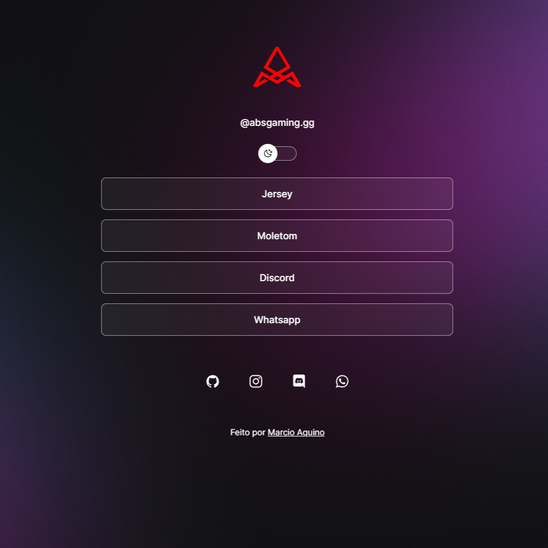

<h1 align="center"> MyLinks </h1>

  

 

  

## 🚀 Tecnologias

Esse projeto foi desenvolvido com as seguintes tecnologias:

- HTML e CSS
- JavaScript
- Git e Github
- Figma

## 💻 Projeto

MyLinks é um agregador de links para usar como cartão de visitas online.

## 🔖 Layout

Você pode visualizar o layout do projeto através [DESSE LINK](<https://www.figma.com/file/BA1SIU8vcx8iGngQLGsRzJ/DevLinks-%E2%80%A2-Projeto-Discover-(Community)?type=design&node-id=10-620&mode=design&t=XRzHWE5CTDzxkMpJ-0>). É necessário ter conta no [Figma](https://figma.com) para acessá-lo.

## Licença

Esse projeto está sob a licença MIT.

---

Feito por Marcio Aquino
